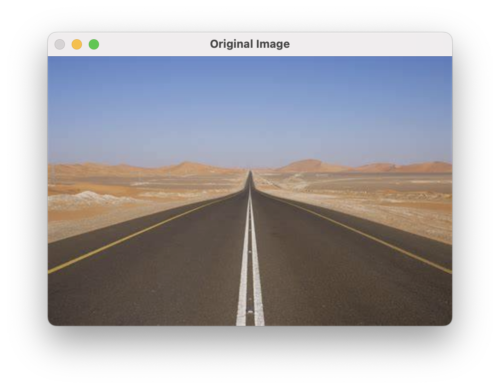
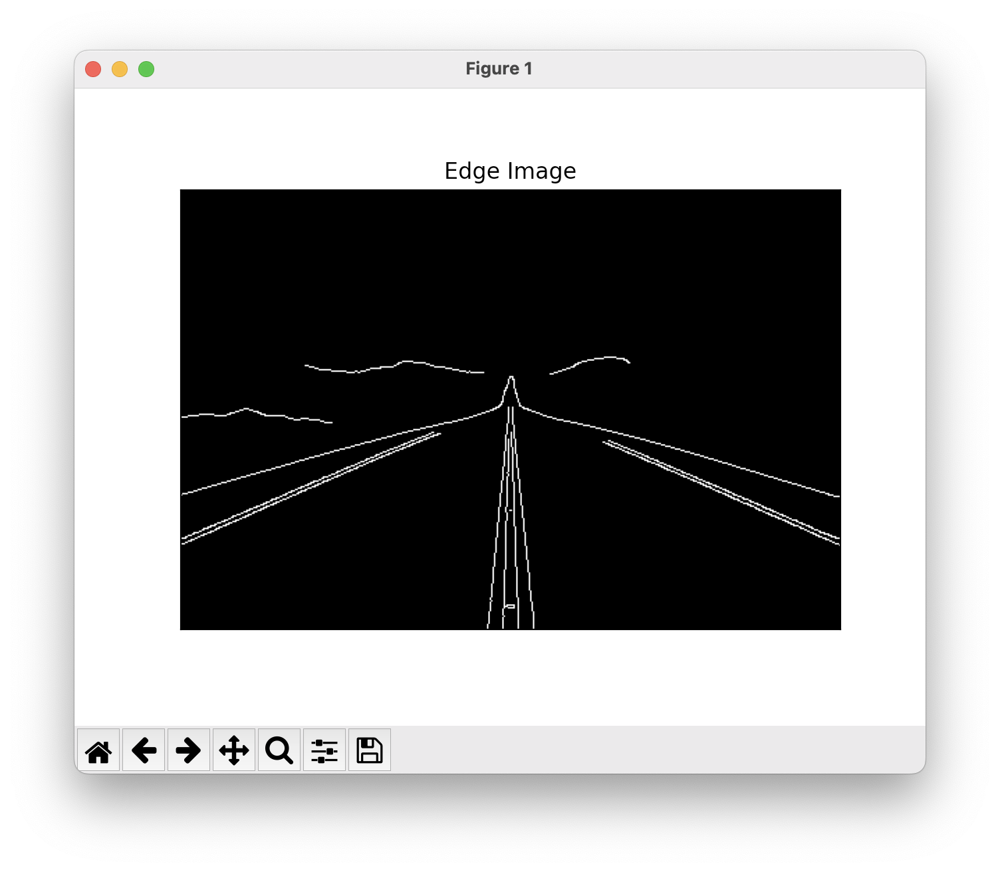
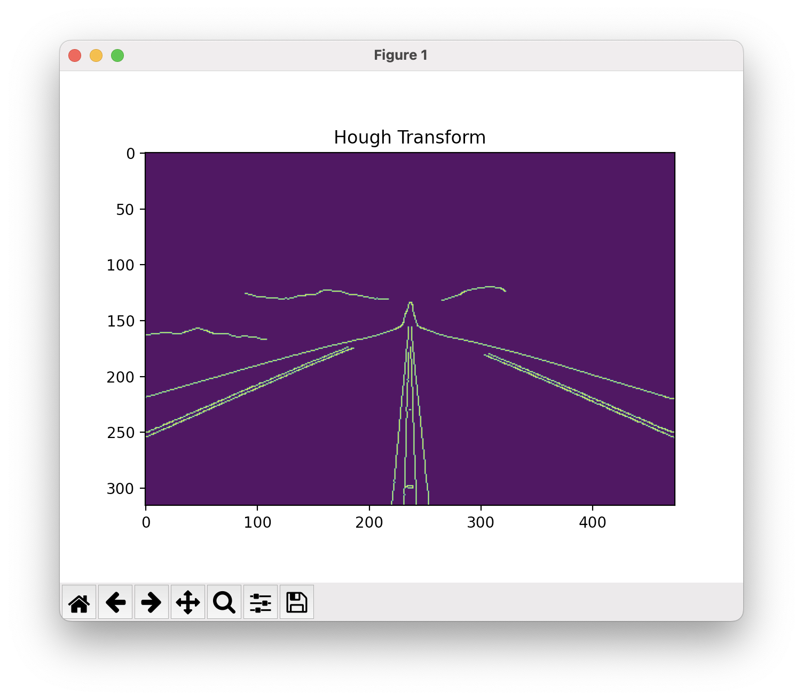

# Edge-Linking-using-Hough-Transform
## Aim:
To write a Python program to detect the lines using Hough Transform.

## Software Required:
Anaconda - Python 3.7

## Algorithm:
### Step1:
<br>

### Step2:
<br>

### Step3:
<br>

### Step4:
<br>

### Step5:
<br>


## Program:
```Python

# Read image and convert it to grayscale image
import cv2
import matplotlib.pyplot as plt
import numpy as np
image = cv2.imread("road.jpeg")
grayImage = cv2.cvtColor(image,cv2.COLOR_BGR2GRAY)
cv2.imshow("Original Image",image)
cv2.imshow("Gray Image",grayImage)


# Find the edges in the image using canny detector and display
cannyEdges = cv2.Canny(image,120,150)
plt.imshow(cannyEdges,cmap='gray')
plt.title('Edge Image')
plt.xticks([])
plt.yticks([])
plt.show()


# Detect points that form a line using HoughLinesP
lines  = cv2.HoughLinesP(cannyEdges,1,np.pi/180,threshold=80,minLineLength = 50,maxLineGap = 250)


# Draw lines on the image

for line in lines:
    x1, y1, x2, y2 = line [0]
    cv2.line(cannyEdges,(x1, y1),(x2, y2),(255, 0, 0),3)


# Display the result
plt.imshow(cannyEdges)


```
## Output

### Input image and grayscale image


### Canny Edge detector output



### Display the result of Hough transform



## Result:
Thus the program is written with python and OpenCV to detect lines using Hough transform. 
